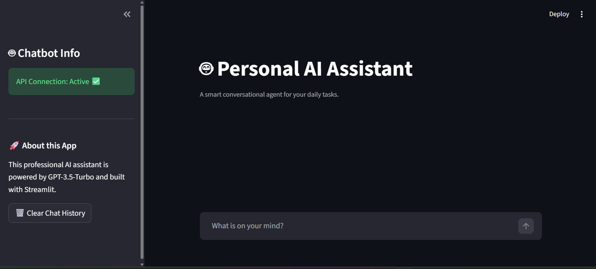

# 🤖 AI Chatbot Assistant - OpenAI & Streamlit

A modern, responsive conversational agent built with **Python**, **Streamlit**, and the latest **OpenAI API (v1.x)**. This project demonstrates how to integrate Large Language Models (LLMs) into a web-based user interface with a professional design.

## ✨ Key Features
- 💬 **Real-time Chat:** Interactive conversational interface with "streaming" text effect.
- ⚙️ **Professional Sidebar:** Dedicated settings area for a clean, distraction-free workspace.
- 🧠 **Context Awareness:** Maintains conversation history using Streamlit Session State.
- 🔒 **Secure API Handling:** Optimized for Streamlit Secrets to protect sensitive keys.

## 🛠 Tech Stack
- **Backend/Logic:** Python 3.9+
- **AI Engine:** OpenAI GPT-3.5-Turbo
- **Frontend:** Streamlit (Custom Chat Components)

## 📸 Interface Preview


## 🚀 Getting Started

### 1. Clone the repository:
```bash
git clone https://github.com/Lynda7/chatbot-1.git

### 2.Install dependencies:
```bash
pip install -r requirements.txt

### 3.Configure your OPENAI_API_KEY in Streamlit Secrets.:
Note: Create a .streamlit/secrets.toml file for local development.

### 4.Run the application:
```bash
Run the application